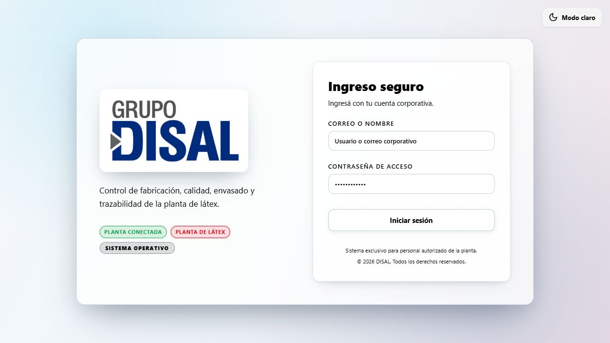
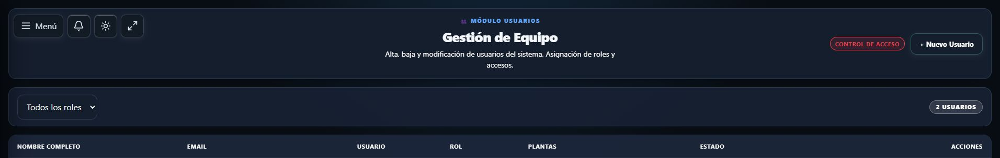
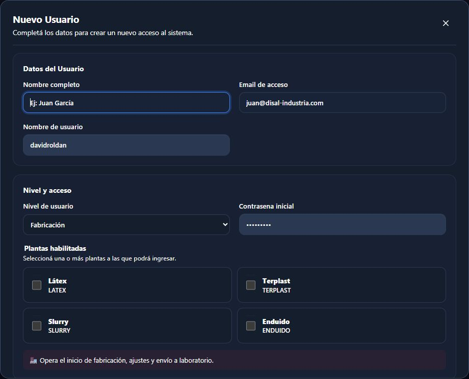
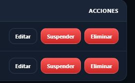
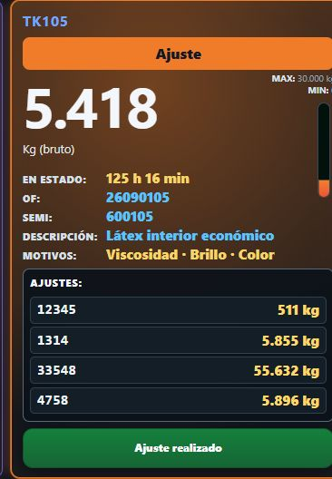
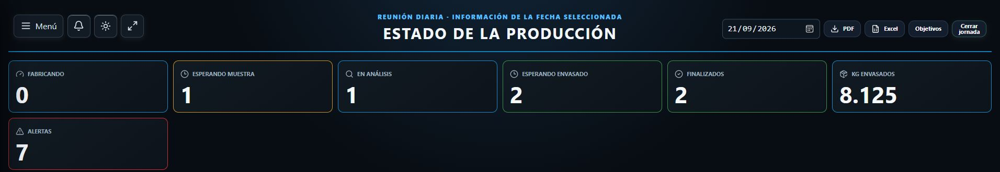
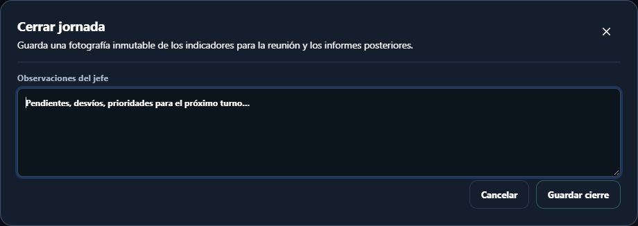
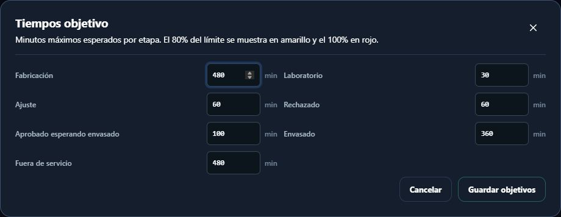
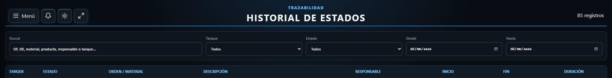

# Manual de usuario · Administrador

**Sistema de Control de Planta DISAL**

**Destinatarios:** administradores autorizados del sistema

**Versión del manual:** 1.0 · septiembre de 2026

---

Las imágenes son capturas del sistema en funcionamiento. Los datos visibles corresponden al momento de la captura; no los copie al registrar una operación. La pantalla puede variar según los permisos de la cuenta y la planta seleccionada.

## 1. Responsabilidad del administrador

El perfil Administrador puede acceder a los paneles de Fabricación, Laboratorio y Envasado, gestionar usuarios, consultar el resumen diario y revisar el historial. Algunas cuentas protegidas también pueden acceder a **Auditoría**.

Las acciones realizadas desde un panel operativo tienen el mismo efecto que si las ejecutara el sector correspondiente. El perfil Administrador debe usarlas sólo para asistencia autorizada o contingencias, nunca para adelantarse al responsable del proceso.

El administrador debe asegurar que cada usuario tenga el rol y las plantas estrictamente necesarios para su tarea.

## 2. Ingreso, selección de planta y salida

### Iniciar sesión

1. Abra el acceso al sistema.
2. Ingrese su correo o nombre de usuario.
3. Ingrese su contraseña.
4. Seleccione **Iniciar sesión**.

El acceso inicial abre el panel de Fabricación. Desde **Menú** puede ingresar a las demás funciones disponibles.

### Seleccionar la planta

El selector de la parte superior del menú determina sobre qué planta se muestran y registran los datos.

1. Abra **Menú**.
2. Revise la planta seleccionada.
3. Si necesita cambiarla, elija la planta correspondiente.
4. Compruebe el nombre y código mostrados en la pantalla antes de operar.

### Finalizar la sesión

Abra **Menú** y seleccione **Salir**. No deje una sesión administrativa abierta ni comparta esta cuenta.

## 3. Menú del administrador

Según los permisos de la cuenta, el menú puede incluir:

- **Fabricación:** operaciones de inicio, corrección, envío a Laboratorio, ajustes, rechazados y servicio.
- **Laboratorio:** recepción de muestras y decisiones de calidad.
- **Envasado:** inicio, cambio, corrección y cierre de OE o trasvase.
- **Resumen diario:** situación productiva, alertas, exportaciones, cierre de jornada y tiempos objetivo.
- **Historial:** búsqueda y trazabilidad de órdenes.
- **Usuarios:** alta, modificación, suspensión, activación y baja de accesos.
- **Auditoría:** disponible sólo para la cuenta protegida habilitada como responsable del sistema.

## 4. Gestión de usuarios

Ingrese en **Menú → Usuarios**. La tabla muestra nombre, correo, usuario, rol, plantas habilitadas y estado.

### Crear un usuario

1. Seleccione **+ Nuevo Usuario**.
2. Complete:
   - **Nombre completo**.
   - **Email de acceso**.
   - **Nombre de usuario:** entre 3 y 40 caracteres; puede contener letras, números, punto, guion y guion bajo.
   - **Nivel de usuario**.
   - **Contraseña inicial:** mínimo 6 caracteres.
   - **Plantas habilitadas:** seleccione al menos una.
3. Revise especialmente el rol y las plantas.
4. Seleccione **Crear Usuario**.
5. Entregue la contraseña inicial por un medio autorizado y solicite que no se comparta.

### Elegir el rol correcto

| Rol | Uso previsto |
| --- | --- |
| Fabricación | Iniciar y corregir fabricaciones, enviar a Laboratorio, responder ajustes y gestionar servicio. |
| Laboratorio | Confirmar muestras y registrar aprobación, ajuste o rechazo. |
| Envasado | Gestionar órdenes de envasado, cierres y trasvases habilitados. |
| Monitoreo | Consultar planta e historial sin realizar operaciones. |
| Jefatura | Consultar resumen, monitoreo e historial; realizar cierres y exportaciones. |
| Administrador | Acceso completo a la operación y gestión de usuarios. |

No asigne Administrador cuando otro rol sea suficiente.

### Editar un usuario

1. Busque el usuario en la tabla. Puede filtrar por rol.
2. Seleccione **Editar**.
3. Modifique nombre, correo, usuario, rol o plantas.
4. Para conservar la contraseña actual, deje **Nueva contraseña** vacía.
5. Para restablecerla, ingrese una nueva contraseña de al menos 6 caracteres.
6. Seleccione **Guardar Cambios**.

Antes de retirar una planta o cambiar un rol, confirme que la persona ya no necesita ese acceso.

### Suspender o activar un usuario

- Use **Suspender** para impedir temporalmente el ingreso sin eliminar el registro.
- Use **Activar** para devolver el acceso.

Lea el mensaje de confirmación y verifique el nombre antes de continuar.

### Eliminar un usuario

Use **Eliminar** cuando corresponda dar de baja el acceso. El sistema conserva el historial de operaciones realizadas por esa persona.

Antes de confirmar:

1. verifique la identidad del usuario;
2. confirme que la baja fue autorizada;
3. compruebe que no debía realizarse sólo una suspensión temporal.

## 5. Asistencia sobre operaciones de planta

### Qué es una tarjeta de tanque

Una **tarjeta** es el recuadro individual de un tanque o equipo en los paneles de Fabricación, Laboratorio y Envasado. Muestra su código, estado y tiempo en ese estado. Según la etapa, también puede mostrar peso bruto en vivo, barra de nivel estimado, condición de señal, OF, SEMI, descripción, peso específico, situación de la muestra, ajuste solicitado u OE activa. Los botones de la tarjeta son las acciones disponibles en ese momento para la cuenta y el estado del tanque.

**Sin señal** indica que no llegó recientemente un peso válido; no permite concluir que el tanque esté vacío. Antes de intervenir, compare el código de la tarjeta con el equipo físico y consulte el manual del sector para interpretar los datos particulares de esa etapa.

El Administrador puede abrir los tres paneles operativos. Antes de actuar:

1. confirme la planta y el tanque;
2. identifique al sector responsable;
3. confirme que la intervención administrativa está autorizada;
4. registre un motivo claro cuando el formulario lo solicite;
5. evite compensar un error mediante una transición ficticia.

Principales efectos:

- **Iniciar fabricación** crea el lote y coloca el tanque en **Fabricando**.
- **Enviar a Laboratorio** abre una espera de muestra.
- **Recibí la muestra** registra la recepción física; no debe usarse si la muestra no llegó.
- **Resolver análisis** registra una decisión de calidad.
- **Iniciar envasado** abre una OE sobre un tanque aprobado.
- **Finalizar y vaciar** cierra el lote y declara el tanque **Vacío**.

Para el detalle de cada operación, consulte el manual del sector correspondiente. El Administrador está sujeto a las mismas validaciones y confirmaciones.

## 6. Resumen diario

Ingrese en **Menú → Resumen diario**.

La pantalla presenta la situación de la fecha seleccionada, incluyendo estados, esperas, muestras, incidencias de calidad, envasado y situaciones que requieren atención.

### Consultar otra fecha

Use el selector de fecha en la parte superior. Los datos históricos no representan necesariamente el estado en vivo actual.

### Exportar

- Seleccione **PDF** para generar un informe imprimible.
- Seleccione **Excel** para obtener una planilla de trabajo.

### Cerrar la jornada

1. Revise la fecha y los indicadores.
2. Seleccione **Cerrar jornada**.
3. Escriba observaciones sobre pendientes, desvíos o prioridades.
4. Seleccione **Guardar cierre**.

El cierre guarda una fotografía de los indicadores. No lo realice hasta que la revisión de la jornada haya terminado.

### Configurar tiempos objetivo

1. Seleccione **Objetivos**.
2. Ingrese los minutos máximos esperados para cada etapa.
3. Seleccione **Guardar objetivos**.

El 80 % del objetivo se muestra como advertencia y el 100 % como situación crítica. Modifique estos valores sólo con autorización operativa.

## 7. Historial y trazabilidad

Ingrese en **Menú → Historial**.

1. Busque por OF, OE, material, producto, responsable o tanque.
2. Abra el registro que necesita revisar.
3. Consulte la línea temporal, ciclos de Laboratorio, ajustes, órdenes de envasado y evolución del peso cuando esté disponible.
4. Use el botón de descarga para generar el informe PDF de la OF.

El peso continuo se obtiene de InfluxDB. Los estados, decisiones, usuarios y órdenes proceden del historial operativo del sistema. Una falta temporal de la gráfica de peso no elimina la trazabilidad restante.

## 8. Auditoría

La opción **Auditoría** aparece únicamente en cuentas protegidas con permiso de responsable del sistema.

Permite:

- seleccionar un período;
- consultar actividad por usuario;
- buscar movimientos por OF, tanque, persona o motivo;
- revisar ingresos correctos y fallidos, bloqueos y operaciones registradas.

La auditoría se utiliza para revisión y seguimiento. No modifica los datos productivos.

## 9. Notificaciones

La cuenta Administrador puede ver avisos de Fabricación, Laboratorio y Envasado y filtrarlos por sector. Al seleccionar un aviso se abre el panel correspondiente y se resalta el tanque.

Marcar un aviso como leído no ejecuta la operación ni confirma una entrega física.

## 10. Seguridad y buenas prácticas

1. Cree una cuenta individual para cada persona; no habilite cuentas compartidas.
2. Asigne el rol mínimo necesario.
3. Habilite únicamente las plantas que correspondan.
4. Suspenda accesos que deban bloquearse temporalmente.
5. Dé de baja accesos que ya no correspondan.
6. No envíe contraseñas por medios no autorizados.
7. Revise dos veces la planta activa antes de una acción operativa.
8. Cierre la sesión administrativa al abandonar el puesto.

## 11. Si aparece un problema

- **Usuario bloqueado o suspendido:** compruebe su estado en **Usuarios**. Active sólo si corresponde.
- **Usuario olvidó la contraseña:** use **Editar**, defina una nueva contraseña y comuníquela de forma segura.
- **No aparece una planta:** revise las plantas habilitadas para esa cuenta.
- **No aparece Auditoría:** esa función requiere una cuenta protegida específica; no está disponible para todos los administradores.
- **“El tanque cambió. Actualizá la pantalla”:** otra operación fue confirmada antes. Actualice y vuelva a revisar; no fuerce una transición.
- **Sin conexión o datos desactualizados:** detenga las operaciones administrativas sobre planta, aplique el procedimiento de contingencia e informe a Sistemas o al responsable designado.
- **Error operativo confirmado:** preserve la evidencia y revise el historial. No borre usuarios ni genere movimientos ficticios para ocultarlo.
