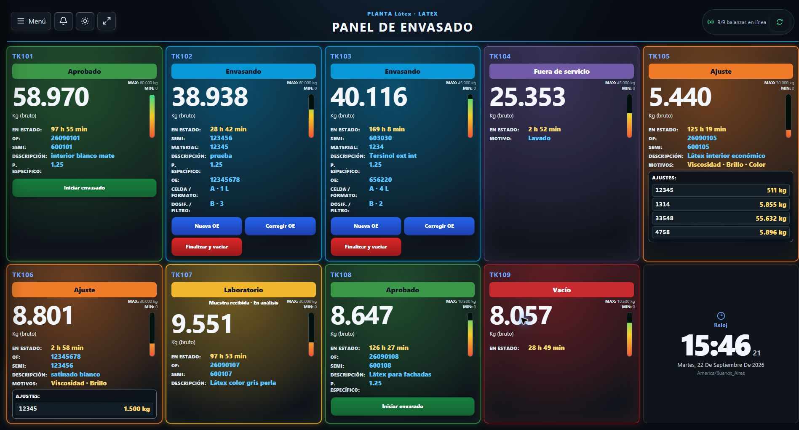
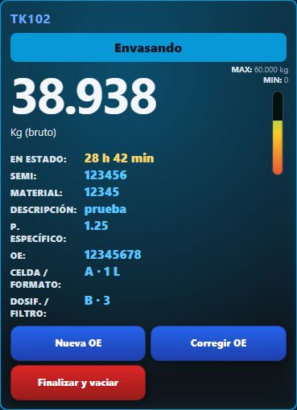
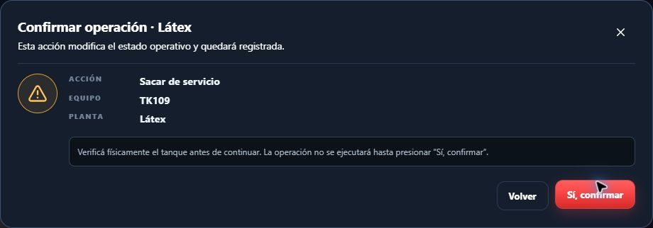
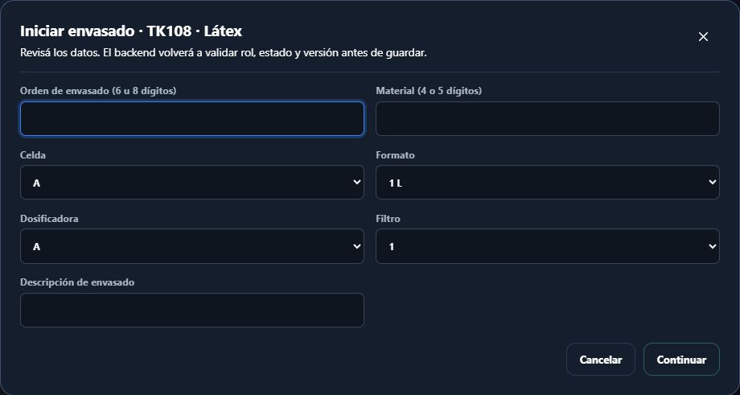
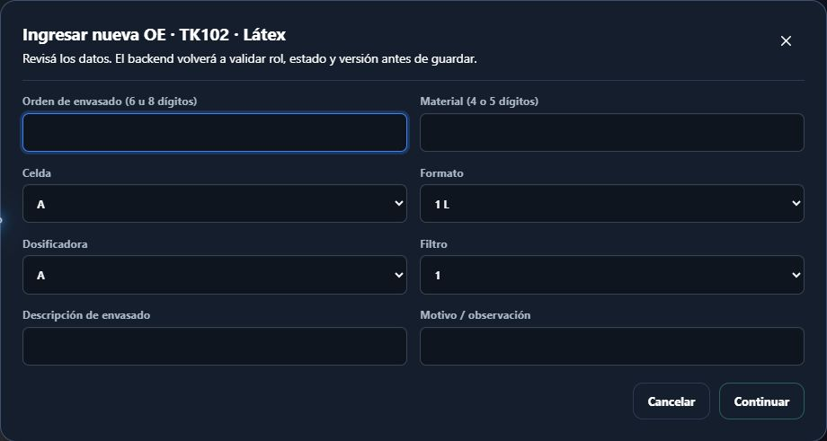
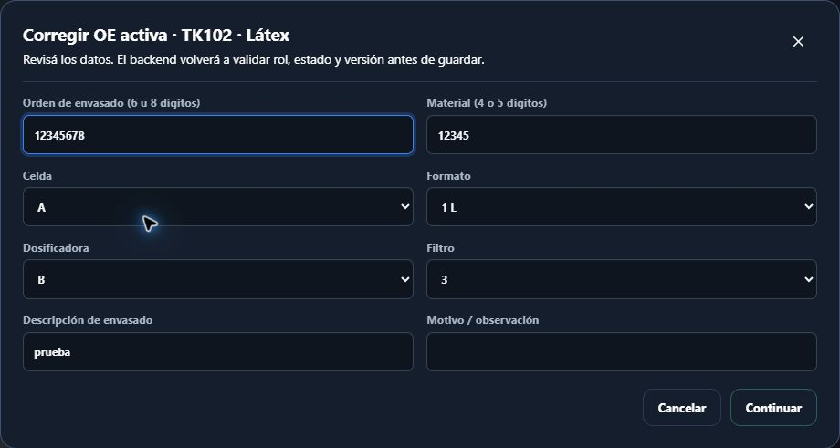
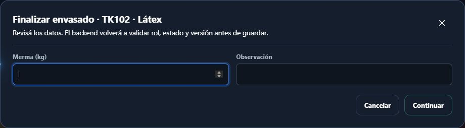

# Manual de usuario · Envasado

**Sistema de Control de Planta DISAL**

**Destinatarios:** personal de Envasado

**Versión del manual:** 1.0 · septiembre de 2026

---

Las imágenes son capturas del sistema en funcionamiento. Los datos visibles corresponden al momento de la captura; no los copie al registrar una operación. La pantalla puede variar según la planta y el estado de los tanques.

## 1. Para qué se utiliza el sistema

El panel de Envasado permite iniciar una orden de envasado sobre un tanque aprobado, registrar cambios de OE, corregir datos y finalizar el envasado. En las plantas configuradas para trasvase, permite iniciar y finalizar esa operación en lugar de crear una OE.

El sistema conserva el responsable y los horarios de cada operación. Cada persona debe trabajar con su propia cuenta.

> **Importante:** el sistema registra el proceso, pero no controla la envasadora, las válvulas ni el trasvase físico. Las maniobras se realizan según los procedimientos de planta.

## 2. Ingreso y salida

### Iniciar sesión

1. Abra el acceso al sistema.
2. Ingrese su correo o nombre de usuario.
3. Ingrese su contraseña.
4. Seleccione **Iniciar sesión**.
5. Compruebe que se abrió el **Panel de Envasado** y que la planta activa es la correcta.

Si tiene acceso a varias plantas, selecciónela desde el menú lateral. Verifique la planta antes de registrar una OE o un trasvase.

### Finalizar la sesión

1. Abra **Menú**.
2. Seleccione **Salir**.

No comparta la cuenta ni deje una sesión abierta. Si no puede ingresar, comuníquese con un administrador.

## 3. Cómo leer el panel

Una **tarjeta** es el recuadro individual de un tanque en el panel. Antes de operar, compare su código (por ejemplo, **TK102**) con el tanque físico y verifique su estado.

Según el estado, una tarjeta puede mostrar:

- tanque y estado actual;
- tiempo transcurrido en ese estado;
- peso bruto recibido en vivo, barra de nivel estimado y condición de señal;
- OF y SEMI provenientes de Fabricación;
- peso específico informado por Laboratorio;
- OE activa, material de Envasado, descripción, celda, formato, dosificadora y filtro;
- acciones disponibles.

Un tanque listo para comenzar aparece como **Aprobado**. Un tanque con una orden activa aparece como **Envasando**.

El indicador **Sin señal** significa que el peso en vivo no se actualiza. No significa que el tanque esté vacío.

## 4. Confirmación de una operación

Todas las operaciones se confirman en dos pasos:

1. Seleccione la acción y complete los datos.
2. Seleccione **Continuar**.
3. Revise el resumen.
4. Seleccione **Sí, confirmar**.

Use **Volver** para corregir o **Cancelar** para salir sin guardar. Confirme sólo después de comprobar el tanque y la operación física correspondiente.

## 5. Iniciar el envasado

Esta acción está disponible cuando el tanque se encuentra **Aprobado**.

1. Identifique físicamente el tanque aprobado.
2. Seleccione **Iniciar envasado**.
3. Complete:
   - **Orden de envasado:** 6 u 8 dígitos.
   - **Material:** 4 o 5 dígitos.
   - **Celda**.
   - **Formato**.
   - **Dosificadora**.
   - **Filtro**.
   - **Descripción de envasado**.
4. Seleccione **Continuar**.
5. Revise especialmente el tanque, la OE, el material y la configuración de la línea.
6. Seleccione **Sí, confirmar**.

El tanque pasará a **Envasando** y la OE quedará activa.

## 6. Ingresar una nueva OE sin vaciar el tanque

Use **Nueva OE** cuando termina una orden y debe comenzar otra sobre el mismo producto y tanque, sin declarar el tanque vacío.

1. En el tanque **Envasando**, seleccione **Nueva OE**.
2. Complete los datos de la nueva orden.
3. Agregue un motivo u observación si corresponde.
4. Revise y confirme.

Al confirmar, el sistema cierra la OE anterior, calcula su duración y abre la nueva. No utilice **Nueva OE** para corregir un error de escritura de la orden actual.

## 7. Corregir la OE activa

Use esta opción para corregir datos de la orden que continúa activa.

1. Seleccione **Corregir OE**.
2. Revise los datos precargados.
3. Corrija la OE, material, celda, formato, dosificadora, filtro o descripción que corresponda.
4. Ingrese el **Motivo / observación** obligatorio.
5. Revise y confirme.

La corrección no crea otra orden. El sistema conserva los valores anteriores, los nuevos, el motivo y el usuario.

## 8. Finalizar el envasado y declarar el tanque vacío

Use esta acción sólo cuando la OE haya terminado y el tanque pueda declararse vacío según el procedimiento de planta.

1. Seleccione **Finalizar y vaciar**.
2. Ingrese la **Merma (kg)** si corresponde.
3. Agregue una observación cuando sea útil.
4. Verifique físicamente la condición del tanque.
5. Revise y confirme.

La operación cierra la OE activa, finaliza el lote y devuelve el tanque a **Vacío**. No existe una validación automática del vaciado basada en el peso; la responsabilidad de confirmar la condición física sigue siendo del usuario y del procedimiento operativo.

## 9. Operación de trasvase

En una planta configurada para terminar mediante trasvase, un tanque **Aprobado** mostrará **Iniciar trasvase** en lugar de **Iniciar envasado**.

### Iniciar trasvase

1. Confirme el origen, destino y condiciones físicas según el procedimiento de planta.
2. Seleccione **Iniciar trasvase**.
3. Agregue una observación si corresponde.
4. Revise y confirme.

### Finalizar trasvase

1. Confirme físicamente que el trasvase terminó.
2. Seleccione **Finalizar trasvase**.
3. Agregue una observación si corresponde.
4. Revise y confirme.

Esta finalización cierra el lote y devuelve el equipo de origen a **Vacío**. No crea una OE.

## 10. Notificaciones

La campana informa, entre otros avisos, cuándo Laboratorio aprueba un tanque. Al seleccionar una notificación se abre el panel y se resalta el tanque relacionado.

Marcar el aviso como leído no inicia el envasado ni cambia el estado del tanque.

## 11. Si aparece un problema

- **No aparece “Iniciar envasado”:** verifique que el tanque esté **Aprobado**, que la planta activa sea correcta y que esa planta no esté configurada para trasvase.
- **“El tanque cambió. Actualizá la pantalla”:** otra persona operó primero. Actualice y revise el estado antes de continuar.
- **Cometió un error en la OE activa:** use **Corregir OE**, no **Nueva OE**.
- **“Sin señal”:** no interprete el valor como confirmación de tanque vacío. Verifique físicamente.
- **No se puede guardar:** revise la longitud de OE y material, y complete todos los selectores y la descripción.
- **No hay conexión:** no confirme operaciones sobre datos posiblemente desactualizados. Aplique el procedimiento de contingencia y avise al responsable.

## 12. Reglas esenciales

1. Utilice su propia cuenta.
2. Verifique planta, tanque, OF, OE y material antes de confirmar.
3. Use **Nueva OE** para un cambio real de orden y **Corregir OE** para corregir la orden vigente.
4. Declare **Finalizar y vaciar** sólo después de verificar físicamente el tanque.
5. No interprete **Sin señal** como tanque vacío.
6. Cierre la sesión al terminar el turno o abandonar el puesto.
