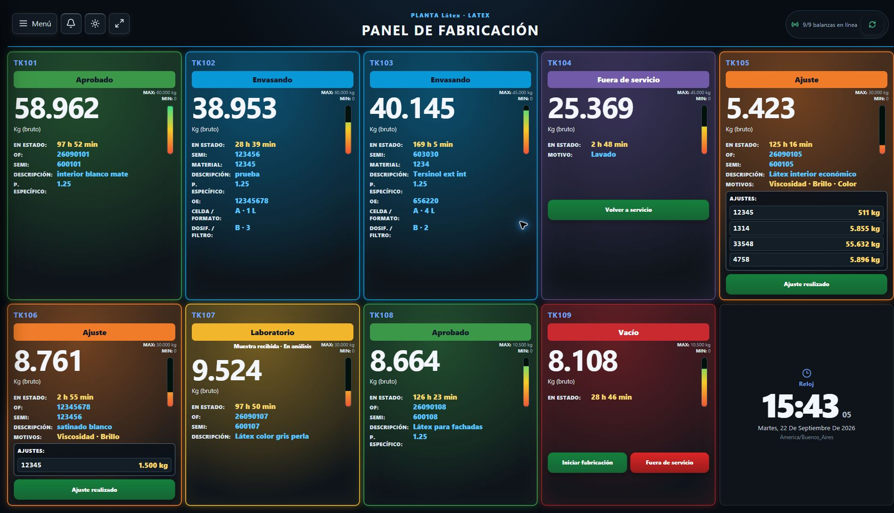
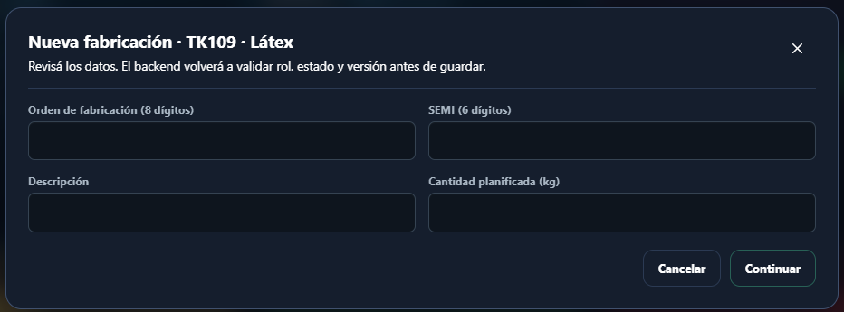
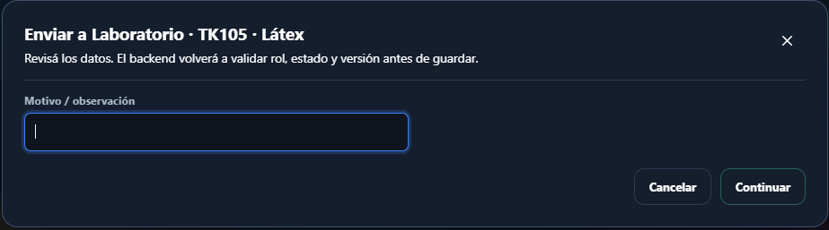
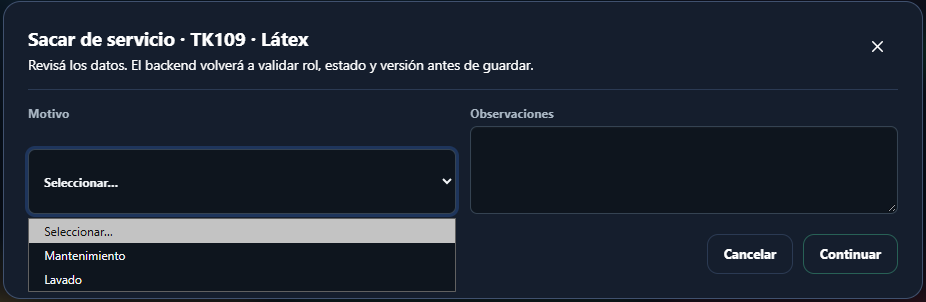

# Manual de usuario · Fabricación

**Sistema de Control de Planta DISAL**

**Destinatarios:** personal de Fabricación

**Versión del manual:** 1.0 · septiembre de 2026

---

Las imágenes son capturas del sistema en funcionamiento. Los datos visibles corresponden al momento de la captura; no los copie al registrar una operación. La pantalla puede variar según la planta y el estado de los tanques.

## 1. Para qué se utiliza el sistema

El panel de Fabricación permite registrar el avance operativo de cada tanque desde el inicio de una orden de fabricación hasta su entrega a Laboratorio. También permite responder a un ajuste, corregir datos cargados, registrar el vaciado de un producto rechazado y administrar la condición de servicio de un tanque vacío.

El sistema conserva quién realizó cada operación y en qué momento. Por eso, cada persona debe utilizar únicamente su propia cuenta.

> **Importante:** el sistema registra y comunica lo ocurrido, pero no controla válvulas, bombas, agitadores ni otros equipos. Las maniobras físicas se realizan según los procedimientos de planta.

## 2. Ingreso y salida

### Iniciar sesión

1. Abra el acceso al sistema en el equipo de planta.
2. En **Correo o nombre**, escriba su correo o nombre de usuario.
3. En **Contraseña de acceso**, escriba su contraseña.
4. Seleccione **Iniciar sesión**.
5. Compruebe que se abrió el **Panel de Fabricación** y que la planta indicada en la parte superior es la correcta.

Si tiene acceso a más de una planta, puede elegirla desde el selector ubicado en el menú lateral. Antes de registrar una operación, verifique siempre el nombre y el código de la planta activa.

### Finalizar la sesión

1. Abra **Menú**.
2. Seleccione **Salir**.

No comparta la cuenta ni deje una sesión abierta cuando se retire del puesto. Si olvidó su contraseña o su usuario aparece suspendido, comuníquese con un administrador.

## 3. Cómo leer el panel

Una **tarjeta** es el recuadro individual de un tanque o equipo en el panel. Busque primero su identificación (por ejemplo, **TK105**) y confirme que coincide con el equipo físico antes de actuar.

Según la planta y el estado, una tarjeta puede mostrar:

- nombre del tanque;
- estado actual, por ejemplo **Vacío**, **Fabricando**, **Laboratorio**, **Ajuste** o **Rechazado**;
- tiempo transcurrido en ese estado;
- peso bruto recibido en vivo y una barra de nivel estimado;
- OF, SEMI y descripción del producto;
- peso específico, si fue registrado;
- motivos, materiales y cantidades cuando existe un ajuste;
- motivo por el que el tanque está fuera de servicio, si corresponde;
- botones disponibles para la operación siguiente.

El panel se actualiza automáticamente. El indicador **Sin señal** significa que el sistema no recibió recientemente un peso válido. No significa que el tanque esté vacío ni reemplaza la verificación física.

El color de atención refleja el tiempo transcurrido respecto del objetivo configurado. No cambia por sí solo el estado del tanque.

## 4. Confirmación de una operación

Las operaciones siguen siempre el mismo esquema:

1. Seleccione el botón de la acción.
2. Complete o revise los datos.
3. Seleccione **Continuar**.
4. Lea el resumen de confirmación.
5. Si todo es correcto, seleccione **Sí, confirmar**.

Puede usar **Volver** para corregir los datos o **Cancelar** para abandonar la operación. No confirme una acción hasta que el hecho haya ocurrido realmente en planta.

## 5. Iniciar una fabricación

Esta acción está disponible cuando el tanque se encuentra **Vacío**.

1. Identifique físicamente el tanque que se utilizará.
2. En su tarjeta, seleccione **Iniciar fabricación**.
3. Complete:
   - **Orden de fabricación:** exactamente 8 dígitos.
   - **SEMI:** exactamente 6 dígitos.
   - **Descripción:** nombre o descripción del producto.
   - **Cantidad planificada (kg):** complétela cuando corresponda.
4. Seleccione **Continuar**.
5. Verifique especialmente el tanque, la OF y el SEMI.
6. Seleccione **Sí, confirmar**.

El tanque pasará a **Fabricando**. Si algún dato obligatorio es inválido, el sistema no permitirá continuar.

## 6. Corregir datos de una fabricación

Mientras el tanque está **Fabricando**, puede corregir la OF, el SEMI o la descripción sin crear otra fabricación.

1. Seleccione **Corregir datos**.
2. Modifique sólo los datos que correspondan.
3. Escriba el **Motivo de la corrección**.
4. Revise y confirme la operación.

La corrección queda registrada con los valores anteriores, los nuevos, el motivo, la fecha y el usuario. No utilice esta función para reemplazar una fabricación por otra distinta.

## 7. Enviar el tanque a Laboratorio

Use esta acción después de terminar el trabajo de Fabricación y comenzar la entrega de la muestra según el procedimiento de planta. Laboratorio confirmará por separado cuándo recibió físicamente esa muestra.

1. En la tarjeta del tanque **Fabricando**, seleccione **Enviar a Laboratorio**.
2. Agregue una observación si corresponde.
3. Revise el tanque y la OF.
4. Confirme la operación.

El tanque pasará a **Laboratorio** y se generará un aviso para ese sector. El sistema comenzará a medir el tiempo de espera hasta que Laboratorio confirme la recepción física de la muestra.

## 8. Realizar un ajuste solicitado por Laboratorio

Cuando Laboratorio solicita un ajuste, la tarjeta pasa a **Ajuste** y muestra los motivos, materiales y cantidades vigentes.

1. Verifique en la tarjeta qué ajuste fue solicitado.
2. Realice físicamente la corrección indicada.
3. Cuando haya terminado, seleccione **Ajuste realizado**.
4. Agregue una observación si es necesaria.
5. Revise y confirme.

El tanque volverá a **Laboratorio** y se abrirá una nueva iteración de muestra. La solicitud anterior no se borra.

Si la información del ajuste parece incorrecta, no confirme **Ajuste realizado**: comuníquese con Laboratorio para que revise la solicitud.

## 9. Registrar el vaciado de un producto rechazado

Cuando el tanque está **Rechazado** y el vaciado físico ya fue realizado:

1. Seleccione **Registrar vaciado**.
2. Escriba el motivo u observación obligatoria.
3. Compruebe el tanque y confirme.

La operación finaliza el lote y devuelve el tanque al estado **Vacío**. No la confirme si todavía queda producto que impida considerar el tanque disponible.

## 10. Sacar y volver a poner un tanque en servicio

### Sacar de servicio

Sólo puede realizarse sobre un tanque **Vacío**.

1. Seleccione **Fuera de servicio**.
2. Elija **Mantenimiento** o **Lavado**.
3. Agregue observaciones cuando sean útiles para el siguiente turno.
4. Revise y confirme.

Mientras permanezca fuera de servicio no podrá iniciarse una fabricación en ese tanque.

### Volver a servicio

1. Confirme físicamente que el tanque está habilitado para operar.
2. Seleccione **Volver a servicio**.
3. Agregue una observación si corresponde.
4. Revise y confirme.

El tanque regresará a **Vacío**.

## 11. Notificaciones

La campana muestra acciones pendientes para su sector. Al seleccionar una notificación, el sistema abre el panel y resalta el tanque relacionado.

Marcar una notificación como leída sólo indica que fue vista. No reemplaza ninguna acción operativa ni cambia el estado del tanque.

## 12. Si aparece un problema

- **“El tanque cambió. Actualizá la pantalla”:** otra persona realizó una operación antes. Cierre el diálogo, actualice el panel y vuelva a revisar el estado.
- **“Sin señal”:** no use el peso mostrado como confirmación de vacío o de carga. Informe la condición según el procedimiento interno.
- **No aparece el botón esperado:** revise el tanque, la planta activa y el estado. Cada acción aparece solamente cuando está permitida.
- **No se pudo leer el estado de la planta o no hay conexión:** no siga trabajando sobre datos que puedan estar desactualizados. Use el procedimiento de contingencia definido por la planta y avise al responsable.
- **Datos incorrectos después de confirmar:** no intente compensarlos con otra operación. Use **Corregir datos** cuando esté disponible o comuníquese con un administrador.

## 13. Reglas esenciales

1. Utilice su propia cuenta.
2. Verifique planta, tanque, OF y SEMI antes de confirmar.
3. Registre las acciones cuando ocurren, no por adelantado.
4. No interprete **Sin señal** como tanque vacío.
5. No cierre ni libere un tanque basándose únicamente en la pantalla.
6. Cierre la sesión al terminar el turno o abandonar el puesto.
