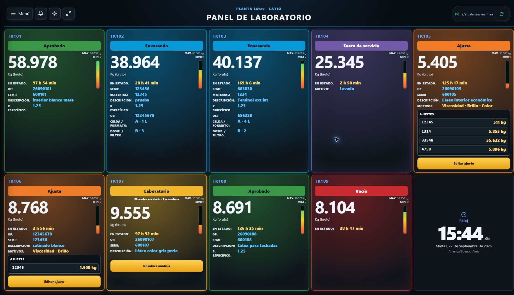
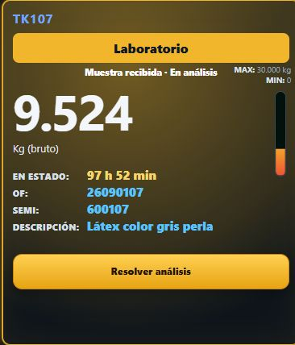
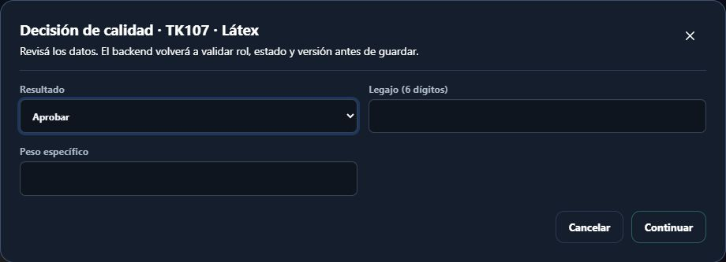
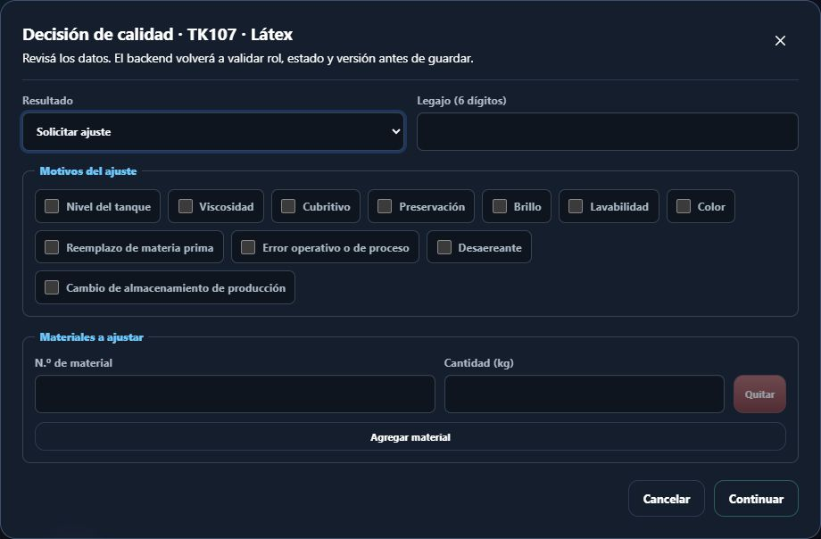
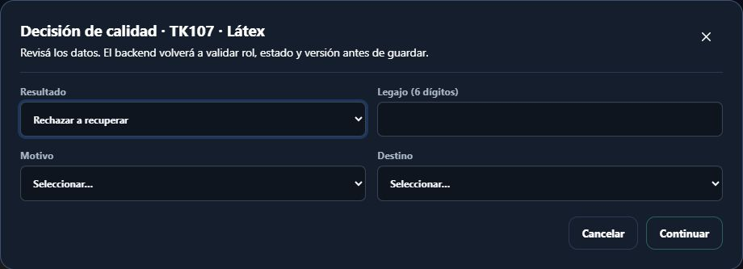
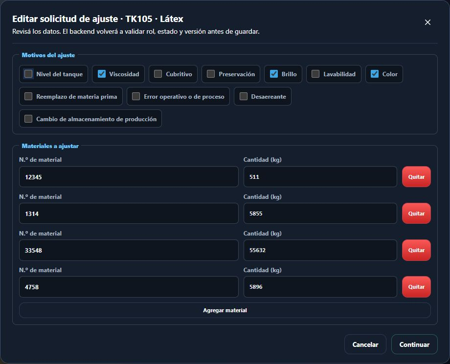

# Manual de usuario · Laboratorio

**Sistema de Control de Planta DISAL**

**Destinatarios:** personal de Laboratorio

**Versión del manual:** 1.0 · septiembre de 2026

---

Las imágenes son capturas del sistema en funcionamiento. Los datos visibles corresponden al momento de la captura; no los copie al registrar una operación. La pantalla puede variar según la planta y el estado de los tanques.

## 1. Para qué se utiliza el sistema

El panel de Laboratorio permite confirmar la recepción física de una muestra y registrar el resultado del análisis: aprobación, solicitud de ajuste o rechazo. Cada intervención queda vinculada con el tanque, la OF, el usuario, la fecha y la hora.

Cada envío desde Fabricación genera una iteración de muestra. Si se solicita un ajuste y el tanque vuelve a Laboratorio, el sistema crea una nueva iteración sin borrar la anterior.

> **Importante:** el sistema registra la decisión de calidad, pero no reemplaza los análisis, controles ni procedimientos físicos de Laboratorio.

## 2. Ingreso y salida

### Iniciar sesión

1. Abra el acceso al sistema.
2. Ingrese su correo o nombre de usuario.
3. Ingrese su contraseña.
4. Seleccione **Iniciar sesión**.
5. Compruebe que se abrió el **Panel de Laboratorio** y que la planta indicada es la correcta.

Si tiene acceso a varias plantas, selecciónela desde el menú lateral. Verifique la planta activa antes de registrar cualquier recepción o resultado.

### Finalizar la sesión

1. Abra **Menú**.
2. Seleccione **Salir**.

No comparta la cuenta ni deje una sesión abierta. Si no puede ingresar, solicite asistencia a un administrador.

## 3. Cómo leer el panel

Una **tarjeta** es el recuadro individual de un tanque en el panel. Identifíquelo por su código (por ejemplo, **TK107**) y compruebe que coincide con la muestra física antes de registrar una acción.

Según el estado del tanque, la tarjeta puede mostrar:

- estado actual;
- tiempo transcurrido en ese estado;
- OF, SEMI y descripción;
- peso bruto recibido y condición de señal;
- peso específico, si ya fue registrado;
- situación de la muestra.
- botones disponibles, como **Recibí la muestra**, **Resolver análisis** o **Editar ajuste**, según corresponda.

Dentro del estado **Laboratorio**, la muestra puede aparecer como:

- **Esperando recepción de muestra:** Fabricación realizó el envío en el sistema, pero Laboratorio todavía no confirmó que recibió la muestra física.
- **Muestra recibida · En análisis:** la recepción ya fue confirmada y puede registrarse el resultado.
- **Análisis resuelto:** la iteración ya tiene una decisión registrada.

El indicador **Sin señal** se refiere al peso en vivo. No invalida ni reemplaza el análisis de calidad.

## 4. Confirmación de una operación

Para toda acción:

1. Seleccione el botón correspondiente.
2. Complete y revise los datos.
3. Seleccione **Continuar**.
4. Lea el resumen.
5. Seleccione **Sí, confirmar** únicamente si la información es correcta.

Use **Volver** para corregir los datos o **Cancelar** para abandonar la operación.

## 5. Confirmar la recepción de una muestra

Confirme la recepción únicamente cuando la muestra física haya llegado a Laboratorio.

1. Identifique la muestra y verifique el tanque y la OF.
2. En la tarjeta que indica **Esperando recepción de muestra**, seleccione **Recibí la muestra**.
3. Lea el mensaje de confirmación.
4. Seleccione **Continuar** y luego **Sí, confirmar**.

Desde ese momento comienza a medirse el tiempo de análisis. Confirmar la recepción no cambia el estado general del tanque: continúa en **Laboratorio**.

No es posible aprobar, solicitar un ajuste ni rechazar antes de confirmar esta recepción.

## 6. Registrar el resultado del análisis

Cuando la tarjeta indique **Muestra recibida · En análisis**:

1. Seleccione **Resolver análisis**.
2. Elija el resultado.
3. Ingrese su **Legajo**, exactamente de 6 dígitos.
4. Complete los datos propios del resultado elegido.
5. Revise la información y confirme.

### Aprobar

1. Elija **Aprobar**.
2. Ingrese el legajo.
3. Ingrese el **Peso específico**, mayor que cero y con hasta 3 decimales.
4. Revise y confirme.

El tanque pasará a **Aprobado** y Envasado recibirá una notificación.

### Solicitar ajuste

1. Elija **Solicitar ajuste**.
2. Ingrese el legajo.
3. Seleccione uno o más **Motivos del ajuste**.
4. En **Materiales a ajustar**, ingrese para cada renglón:
   - número de material;
   - cantidad positiva en kilogramos.
5. Use **Agregar material** si necesita más renglones.
6. Revise cuidadosamente materiales y cantidades.
7. Confirme.

El tanque pasará a **Ajuste** y Fabricación verá la solicitud completa.

### Rechazar a recuperar

1. Elija **Rechazar a recuperar**.
2. Ingrese el legajo.
3. Seleccione el motivo.
4. En **Destino**, elija:
   - **Recuperar en el mismo tanque**, o
   - **Bajar producto para futuras fabricaciones**.
5. Revise y confirme.

El tanque pasará a **Rechazado** y Fabricación será notificada.

### Rechazar a destruir

1. Elija **Rechazar a destruir**.
2. Ingrese el legajo.
3. Seleccione el motivo.
4. Revise y confirme.

El tanque pasará a **Rechazado** y Fabricación será notificada.

## 7. Corregir una solicitud de ajuste

Mientras el tanque permanezca en **Ajuste**, Laboratorio puede corregir la solicitud vigente.

1. Seleccione **Editar ajuste**.
2. Revise los motivos, materiales y cantidades precargados.
3. Realice las correcciones necesarias.
4. Confirme la operación.

La nueva información reemplaza la solicitud vigente que ve Fabricación, pero la modificación queda auditada. No use esta función después de que Fabricación haya informado **Ajuste realizado**; en ese momento ya corresponde analizar la nueva muestra.

## 8. Notificaciones

La campana muestra avisos destinados a Laboratorio. Al abrir un aviso, el sistema navega al panel y resalta el tanque relacionado.

Marcar un aviso como leído no confirma la recepción física de la muestra. Esa recepción se registra únicamente con **Recibí la muestra**.

## 9. Si aparece un problema

- **No aparece “Resolver análisis”:** primero debe confirmarse **Recibí la muestra**.
- **“El tanque cambió. Actualizá la pantalla”:** otro usuario actuó antes. Cierre el diálogo, actualice y revise nuevamente.
- **No aparece el tanque esperado:** compruebe la planta activa y consulte la notificación recibida.
- **La solicitud de ajuste tiene un error:** use **Editar ajuste** mientras el tanque continúe en **Ajuste**.
- **No se puede guardar:** revise legajo, resultado y campos obligatorios. Las cantidades deben ser positivas.
- **No hay conexión o el estado no puede leerse:** no registre decisiones sobre información posiblemente desactualizada. Aplique el procedimiento de contingencia e informe al responsable.

## 10. Reglas esenciales

1. Utilice su propia cuenta y su propio legajo.
2. Confirme **Recibí la muestra** sólo cuando la muestra física haya llegado.
3. Revise tanque, OF y SEMI antes de resolver el análisis.
4. Controle cuidadosamente materiales y cantidades de cada ajuste.
5. No use una notificación leída como sustituto de una recepción o decisión.
6. Cierre la sesión al terminar el turno o abandonar el puesto.
