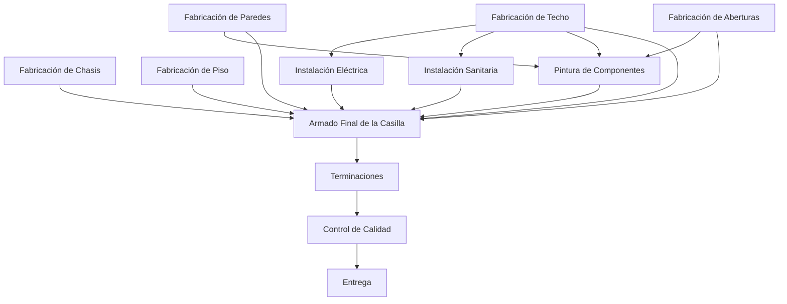

# Transformación productiva de DISAL

## Objetivo

El sistema definitivo representa cada casilla rural como una Orden de Producción con un proyecto de fabricación por etapas paralelas, dependencias explícitas y responsables propios.

Se conserva `Order` como agregado central y se reutilizan clientes, presupuestos, usuarios, recursos, materiales, adjuntos, auditoría y entrega.

## Decisión productiva aprobada

La producción no es una secuencia lineal. El grafo vigente es:

Armado Final es una barrera: no se puede iniciar hasta que todas sus dependencias estén completas.

## Implementación actual

### Completado

- Identidad visual, textos, configuración y contenedores DISAL
- Prefijo de órdenes `DISAL-AAAA-NNNN`.
- Modelos RC4400, RC4900 y RC6000.
- Revisiones de modelo para preservar historial.
- Plantillas de 12 etapas productivas y grafo de dependencias.
- Snapshot de etapas y dependencias al crear una casilla.
- Estados `BLOQUEADA`, `DISPONIBLE`, `EN_PROCESO`, `PAUSADA`, `COMPLETADA`, `RETRABAJO` y `CANCELADA`.
- Responsables múltiples por etapa.
- Vínculo único entre usuario operario y recurso humano.
- Sesiones de trabajo y regla de un cronómetro activo por operario.
- Liberación automática de etapas.
- Progreso ponderado y estado global derivado.
- Formulario “Nueva casilla” con modelo, serie, planificación y asignación por etapa.
- Detalle visual del flujo completo.
- Gestión posterior de responsables por etapa desde la ficha de Orden de Producción.
- Terminal de operario orientada a etapas.
- Mapa del supervisor con avance, trabajo activo, responsables y bloqueos.
- Escenario de ocho casillas y cinco operadores.

### Pendiente de evolución

- Administración visual de modelos, revisiones y plantillas.
- Adjuntos, consumos e incidencias capturados directamente desde una etapa.
- Listas de materiales previstas por modelo.
- Checklist parametrizable de calidad y entrega.
- Reportes de tiempo previsto contra real por etapa.
- Adaptación completa de dashboard, calendario, pantalla TV y copiloto a métricas del grafo.

## Reglas de negocio vigentes

1. Una orden productiva representa una casilla.
2. Una casilla se crea desde una revisión de modelo.
3. La revisión se copia; nunca se consulta como definición viva durante la ejecución.
4. Una etapa solo se inicia si todas sus dependencias están completas.
5. Un operario solo puede iniciar etapas a las que está asignado.
6. Un operario no puede mantener dos sesiones activas.
7. Completar una etapa puede liberar varias ramas en paralelo.
8. El progreso se calcula por pesos, no por un estado manual de la orden.
9. La orden queda `FINALIZADA` cuando todas las etapas obligatorias están completas.
10. La entrega comercial conserva su cierre y evidencia existentes.

## Próximos módulos

1. Materiales, fotografías e incidencias por etapa.
2. Calidad y retrabajo.
3. Reportes productivos por sector, modelo y operario.
4. Copiloto contextual sobre el grafo real.
